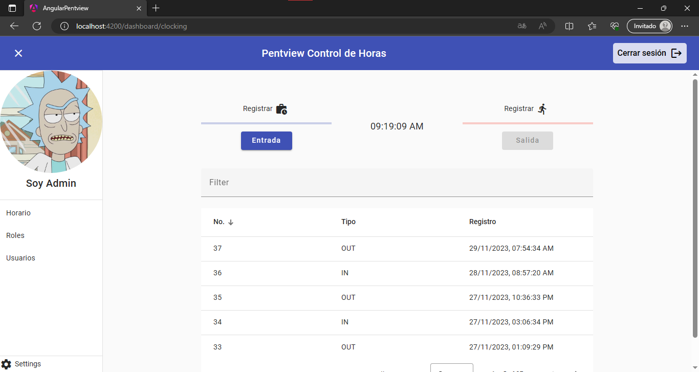
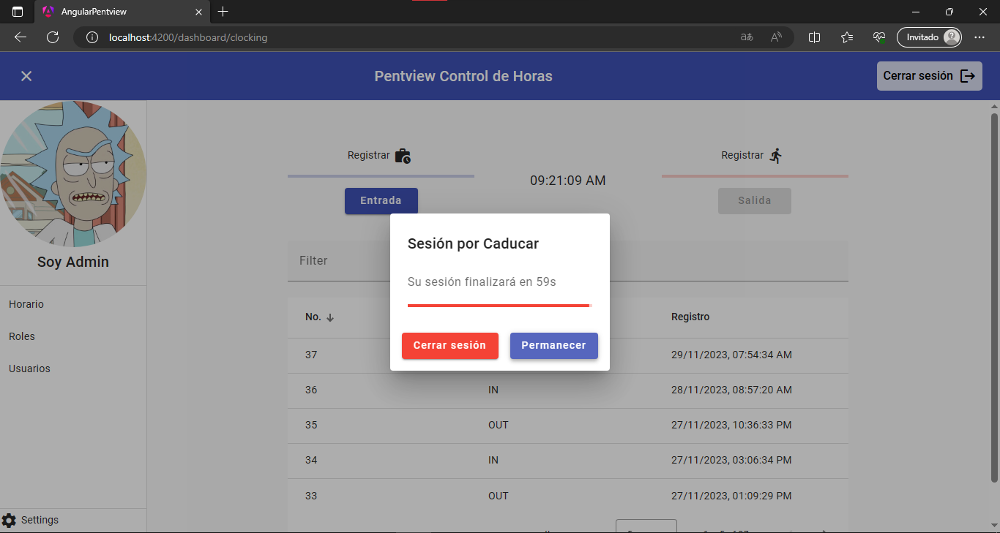

# Angular Pentview Control de Horas

## Requerimientos
- [x] Acceso a todas las rutas con Bearer token (excepto Login)
- [x] Módulos para el rol de Administrador: PERFIL, HORARIO, ROLES y USUARIOS
- [x] Módulos para otros roles: PERFIL y HORARIO
- [x] El Administrador en el módulo de USUARIOS puede: CREAR, LISTAR y ELIMINAR
- [x] Todos los usuarios pueden actualizar sus datos en el módulo PERFIL
- [x] Todos los usuarios pueden registrar ENTRADA/SALIDA en el módulo HORARIO
- [x] Se debe mostrar una notificación de caducidad de sesión al usuario (60s):
    - [x] Cerrar notificación: no se ejecutan acciones
    - [x] Cerrar sesión: el usuario termina su sesión
    - [x] Extender sesión: el sistema obtiene un nuevo token

## Tecnología
- [x] Angular v11+
- [x] Typescript

## Dependencias
- Angular v17
- Angular Material v17
- Angular Router v17
- Typescript v5
- TailwindCSS v3
- postgresql 15.2

## Descripción
Pentview requiere un sistema de Control de Horas para la gestión de su personal permitiendo el registro de horas de entrada/salida y la gestión de sus usuarios con el rol respectivo de cada uno. La plataforma debe contar con controles de la autenticación y ser responsiva.

## Resultado

### Login

 

### Registro de Horas

 

### Gestión de Roles

### Gestión de Usuarios

### Registrar Usuario

### Eliminar Usuario

 

### Caducidad de Sesión

 

### Diseño Responsivo

 
 

## Versionamiento

(Tiber) **Noviembre 2023 v0.8**

* Funcionalidades implementadas
* Controles aplicados
* Diseño responsivo