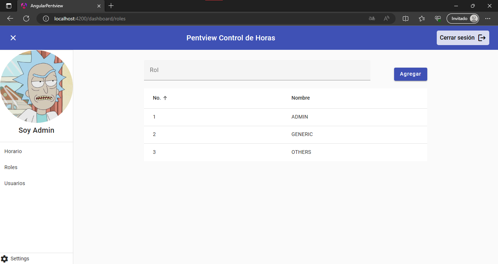

# Angular Pentview Control de Horas

## Requerimientos
- [x] Acceso a todas las rutas con Bearer token (excepto Login)
- [x] Módulos para el rol de Administrador: PERFIL, HORARIO, ROLES y USUARIOS
- [x] Módulos para otros roles: PERFIL y HORARIO
- [x] El Administrador en el módulo de USUARIOS puede: CREAR, LISTAR y ELIMINAR
- [x] Todos los usuarios pueden actualizar sus datos en el módulo PERFIL
- [x] Todos los usuarios pueden registrar ENTRADA/SALIDA en el módulo HORARIO
- [x] Se debe mostrar una notificación de caducidad de sesión al usuario (60s):
    - [x] Cerrar notificación: se cierra sesión cuando el token expira
    - [x] Cerrar sesión: el usuario termina su sesión
    - [x] Extender sesión: el sistema obtiene un nuevo token

## Tecnología
- [x] Angular v11+
- [x] Typescript

## Dependencias
- Angular v17
- Angular Material v17
- Angular Router v17
- Typescript v5
- TailwindCSS v3

## Descripción
Pentview requiere un sistema de Control de Horas para la gestión de su personal permitiendo el registro de horas de entrada/salida y la gestión de sus usuarios con el rol respectivo de cada uno. La plataforma debe contar con controles de la autenticación y debe ser responsiva.

## Solución

Al estar construida con Angular v17 esta aplicación no utiliza módulos como base, sino que implementa componentes standalone los cuales se integran importándolos directamente desde los otros componentes.

 

Protección de rutas:

- authGuard: desbloquea las rutas del sistema si el usuario se ha autenticado, tanto el `dashboard` como sus rutas hijas `profile`, `clocking`, `roles` y `users`.
- roleGuard: desbloquea las rutas específicas de usuarios con rol administrador, es decir `roles` y `users`.

Arquitectura de la aplicación:

- Auth: este módulo abarca todo lo relacionado a la autenticación, tanto `components`, `services` y `guards`.
- Base: este módulo abarca todo lo que será utilizado en la raíz de la aplicación, es decir aquello que es usado globalmente.
- Core: este módulo abarca los requisitos específicos de la aplicación, es decir `profile`, `clocking`, `roles` y `users`. 

## Resultado

### Login

 

### Registro de Horas

 

### Gestión de Roles

### Gestión de Usuarios

### Registrar Usuario

### Campos Requeridos

### Control de Errores HTTP

 

### Eliminar Usuario

 

### Caducidad de Sesión

 

### Diseño Responsivo

 
 

## Versionamiento

(Tiber) **Noviembre 2023 v0.11**

* Actualización de README
* Actualización de comentarios
* Integración de 404 NotFound
* Fixes y actualización de diseño

(Tiber) **Noviembre 2023 v0.8**

* Funcionalidades implementadas
* Controles aplicados
* Diseño responsivo